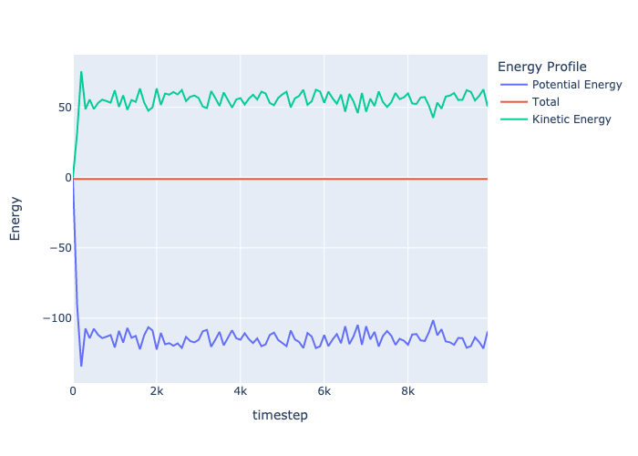

# Molecular Dynamics from scratch

## Step1
* Design architecture
* Lennerd-Jhones potential

## Step2
* Clean-up codes
* Protting
* Initialize module

## Step3
* Periodic boundary condition
* Cutoff distance
* Normalize units

## Step4
* Troubleshooting of energy conservation

## Step5
* Use Plotly